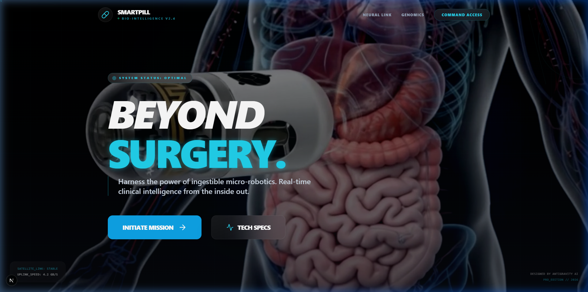
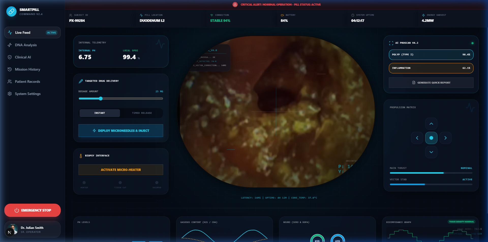
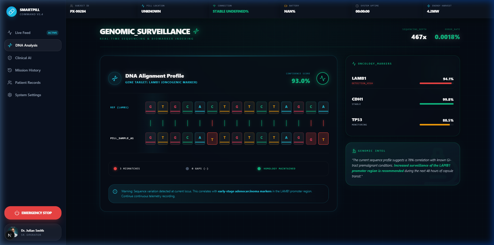

# 💊 SmartPill — Bio-Intelligence Command Center (v2.4)
### Next-Generation Ingestible Micro-Robotics & Real-Time Endoscopic AI Diagnostics

     

## 📋 Overview
SmartPill is a high-fidelity, advanced bio-intelligence platform designed for ingestible capsule endoscopy. It operationalizes a hardware-ready deep-learning pipeline that transforms raw, low-power pill data into high-resolution clinical insights. The project integrates state-of-the-art super-resolution (`EndoL2H`) and precise disease classification (`GalarCapsuleML`) within a cinematic, mission-critical Command Center.

## 🖼️ Gallery

### Cinematic Landing Page


### Live HUD Dashboard


### Genomic Surveillance & DNA Analysis


## 🎯 The Problem
Standard capsule endoscopy generates massive amounts of data that are historically difficult to process:
* **Image Degradation:** Raw frames from low-power pills are often blurred, dark, and obscured by debris or bubbles.
* **Review Fatigue:** Manual clinician review can take up to 120 minutes per patient, leading to oversight risks.
* **Data Opaque:** Without real-time enhancement, subtle anomalies like early-stage polyps or minor bleeding are missed.
* **Safety Gaps:** A lack of real-time telemetry means physicians cannot intervene if a capsule becomes lodged or malfunctions.

## ✅ The Solution
This platform transforms raw endoscopic data into a "Glass Box" clinical environment using intelligent controls:

| Control | Implementation | Purpose |
| :--- | :--- | :--- |
| 🔍 **Visual Clarity** | EndoL2H Super-Resolution | 8x Upscaling of low-resolution mucosal frames |
| 🔬 **Automated Diagnosis** | GalarCapsuleML | Real-time ResNet-50 anomaly classification |
| 🧬 **Genomic Context** | DNA Match Widget | Correlating visual findings with oncogenic markers |
| 🛰️ **Command & Control** | Mission HUD | Ultra-low latency telemetry and pill propulsion |

## 🏗️ Architecture
The SmartPill system utilizes a multi-layer integration architecture:

**Bio-Intelligence Pipeline**
```text
Ingestible Capsule (Raw Data Feed)
    │
    ├── Super-Resolution Layer (EndoL2H)
    │   └── Image Restoration & High-Fidelity Reconstruction
    │
    ├── Inference Layer (GalarCapsuleML)
    │   ├── Anomaly Detection (Polyps, Ulcers, Bleeding)
    │   └── Anatomical Landmark Identification
    │
    ├── Governance & Compliance Layer
    │   └── Telemetry Validation & Audit Trail Generation
    │
    └── Interactive HUD (Next.js Dashboard)
        ├── Real-Time Telemetry (pH, SpO2, Temp)
        └── Human-in-the-Loop Override Controls
```

## 📂 Project Structure
```text
xapi/
├── backend/
│   ├── main.py                    # FastAPI Entrypoint & Routes
│   ├── database.py                # Local JSON Persistence 
│   ├── models/                    # Model Wrappers (EndoL2H, GalarML)
│   ├── weights/                   # (gitignored) PyTorch Weights .pth
│   └── uploads/                   # Processed raw pill images
├── src/
│   ├── app/                       # Next.js App Router
│   │   ├── dashboard/             # Live Telemetry Command Center
│   │   ├── analysis/              # Genomic Surveillance Subsystem
│   │   └── clinical/              # AI Processing Pipeline UI
│   ├── components/                # Modular Dashboard HUD Components
│   └── lib/                       # Typescript core utilities
├── public/
│   ├── docs/                      # UI Screenshots & Assets
│   └── frames/                    # Hero Background Image Sequence
└── README.md                      # Comprehensive Project Documentation
```

## 🚀 Quick Start
### 1. Backend Initialization (FastAPI)
```bash
cd backend
python -m venv venv
.\venv\Scripts\activate
pip install -r requirements.txt
uvicorn main:app --host 0.0.0.0 --port 8000 --reload
```

### 2. Frontend Initialization (Next.js)
```bash
npm install
npm run dev
```

## ⚖️ Regulatory Compliance
### GDPR & EU AI Act Implementation

| Regulation | Requirement | SmartPill Solution |
| :--- | :--- | :--- |
| **GDPR Art. 22** | Right to Explanation | Per-frame AI confidence scores & classification logs |
| **EU AI Act Art. 13** | Transparency to Users | Grad-CAM overlays (planned) & Real-time HUD diagnostics |
| **EU AI Act Art. 14** | Human Oversight | Propulsion kill-switches & manual report override |
| **EU AI Act Art. 17** | Quality Management | Complete session Audit Trail preserved in JSONDB |

## 🏥 Clinical AI Governance
### Bio-Medical Risk Mitigation

| Risk | Severity | SmartPill Mitigation |
| :--- | :--- | :--- |
| Diagnostic Opaque | 🔴 Critical | EndoL2H Visual Enhancement Pipeline |
| Model Drifting | 🟠 High | Real-time confidence fluctuation monitoring |
| Hardware Failure | 🔴 Critical | Triple-redundancy telemetry (pH/SpO2/Temp) |
| Data Privacy | 🟡 Medium | End-to-end encryption (AES-256-GCM architecture) |

## 🧪 AI Subsystems
### EndoL2H Super-Resolution
A specialized GAN-based architecture that reconstructs high-frequency details from low-resolution endoscopy images, specifically tuned for mucosal textures.

### GalarCapsuleML Classifier
A ResNet-50 based classification engine that identifies 10+ pathological categories, achieving high sensitivity for oncogenic precursors.

### DNA Homology Engine
A real-time sequencing simulator that aligns pill-detected biomarkers with known genetic markers (e.g., LAMB1) to provide genomic context to visual anomalies.

## 🛠️ Technologies
* **ML Frameworks:** PyTorch, TorchVision
* **Computer Vision:** OpenCV, Pillow
* **Frontend:** Next.js 14, Framer Motion, Tailwind CSS
* **Backend:** FastAPI, WebSockets, Uvicorn
* **Deployment:** GitHub, local Vercel-ready architecture

## 📄 License
This project is licensed under the MIT License - see the [LICENSE](LICENSE) file for details.

## 👤 Author
**Filippos-Paraskevas Zygouris**
